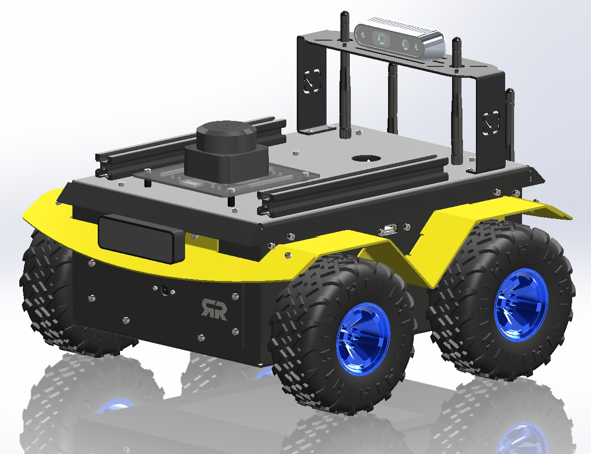

# 🤖 BeetleBot — Professional ROS2 Robot Platform



> **Production-grade ROS2 Jazzy mobile robot for university labs and research institutes.**  
> Built and shipped by [VEEROBOT® / Siliris Technologies](https://veerobot.com) — Bengaluru, India.

[](https://docs.ros.org/en/jazzy/)
[](https://www.raspberrypi.com)
[](https://www.st.com)
[](LICENSE)

---

## What is BeetleBot?

BeetleBot is a **rugged, fully autonomous mobile robot** designed for university robotics labs, research institutes, and algorithm development teams who need a serious platform — not a toy.

Unlike hobby robots, BeetleBot uses an **aluminium chassis, metal gear motors, a dedicated STM32F405 real-time motor controller (Lyra), and a complete ROS2 Nav2 stack** — all pre-configured and ready to deploy.

**Comparable to Clearpath Husky or AgileX Scout in capability. Significantly more accessible in cost.**

Deployed at university robotics labs across India. Available for worldwide purchase and shipping.

---

## Hardware at a Glance

| Spec | Detail |
|------|--------|
| **Dimensions** | 375 × 360 × 245 mm |
| **Weight** | ~2.2 kg |
| **Drive** | 4-Wheel Skid-Steer |
| **Max Speed** | 1.0 m/s |
| **Payload** | 1 kg |
| **Battery** | 3S Li-Ion 11.1V 10Ah (5–6 hr runtime) |
| **Compute** | Raspberry Pi 5 (8GB RAM) |
| **Motor Controller** | STM32F405 @ 168 MHz (FreeRTOS, 20Hz PID) |
| **LiDAR** | RPLiDAR C1 — 360°, 12m range |
| **IMU** | LSM6DSRTR — 6-axis, 100Hz |
| **Encoders** | 3600 ticks/revolution per wheel |
| **Camera** | Raspberry Pi Camera V1.3 — 5MP |
| **Communication** | WiFi 6 (2.4/5GHz), Ethernet, UART |
| **OS** | Ubuntu 24.04 + ROS2 Jazzy (pre-installed) |

---

## Architecture

```
┌──────────────────────────────────┐
│   Laptop / PC (Optional)         │
│   RViz · Gazebo · SSH Dev        │
└───────────┬──────────────────────┘
            │ WiFi / Ethernet
            ▼
┌──────────────────────────────────┐
│   Raspberry Pi 5 — ROS2 Brain   │
│   Nav2 · SLAM · EKF · Joystick  │
└────┬──────────────┬───────┬──────┘
     │ UART3        │ USB   │ USB
     ▼              ▼       ▼
┌──────────┐  ┌────────┐ ┌────────┐
│  Lyra    │  │ Camera │ │ LiDAR  │
│ STM32F405│  │  V1.3  │ │   C1   │
│          │  └────────┘ └────────┘
│ 4× JGB37 Motors
│ 4× Quadrature Encoders
│ IMU LSM6DSRTR
│ Battery Monitor
└──────────┘
```

**Lyra** is BeetleBot's custom STM32-based real-time motor controller. It runs FreeRTOS with deterministic 20Hz PID loops, watchdog safety, multi-layer fault detection, and a binary serial protocol to the Raspberry Pi. Linux cannot do real-time motor control — Lyra handles everything the Pi cannot.

---

## Software Stack

| Layer | Technology |
|-------|-----------|
| OS | Ubuntu 24.04 Server (64-bit ARM) |
| Middleware | ROS2 Jazzy Jalisco |
| Navigation | Nav2 (global + local planner) |
| Mapping | SLAM Toolbox |
| Localization | AMCL + robot_localization EKF |
| Simulation | Gazebo Harmonic (URDF + SDF) |
| Motor Control | Custom FreeRTOS firmware (STM32F405) |
| Sensor Fusion | Extended Kalman Filter (wheel odometry + IMU) |

---

## Quick Start

### Prerequisites
- BeetleBot hardware (see [Purchase](#purchase--contact))
- Laptop running Ubuntu 22.04 or 24.04
- ROS2 Jazzy installed on laptop (for visualization)

### On the Robot (SSH)

```bash
# Source the command utility
source ~/lyra_ws/lyra_commands.sh

# Manual joystick control
lyra-launch-robot-teleop

# Build a map (SLAM)
lyra-launch-robot-slam

# Autonomous navigation with an existing map
lyra-launch-robot-nav ~/maps/my_map.yaml

# Health check
lyra-status
lyra-battery
```

### Key Commands

```bash
lyra-arm               # Enable motors (required before driving)
lyra-disarm            # Disable motors
lyra-stop              # Emergency stop
lyra-launch-rviz       # Open RViz on laptop
lyra-nodes             # List running ROS2 nodes
lyra-topics            # List active topics
```

### ROS2 Topics

```bash
/cmd_vel               # Velocity commands (geometry_msgs/Twist)
/odom                  # Wheel odometry
/scan                  # LiDAR (sensor_msgs/LaserScan)
/imu/data_raw          # IMU data
/battery_voltage       # Battery level
/joy                   # Joystick input
```

---

## Documentation

Full documentation is available at:

📖 **[docs.veerobot.com/ros-robots/beetle-bot](https://docs.veerobot.com/ros-robots/beetle-bot)**

Includes:
- Hardware Familiarization
- System Setup Guide
- ROS2 Communication & Tools
- Robot Simulation with Gazebo
- Sensor Data Visualization
- IMU Signal Processing
- Teleoperation Control
- Sensor Fusion with EKF
- SLAM Mapping
- Camera-Based Perception
- Localization Techniques
- Autonomous Navigation
- Nav2 Optimization Guide

**Estimated learning time: 40–60 hours from beginner to full autonomous navigation.**

---

## Repository Structure

```
BeetleBot/
├── lyra_ws/
│   ├── lyra_bringup/       # Launch files (teleop / slam / nav)
│   ├── lyra_control/       # Motor control node
│   ├── lyra_bridge/        # STM32 serial bridge
│   ├── lyra_slam/          # SLAM configuration
│   ├── lyra_nav2/          # Nav2 configuration
│   ├── camera_ros/         # Camera driver
│   └── sllidar_ros2/       # RPLiDAR driver
├── STM32F405RGTx/          # Lyra firmware source (FreeRTOS / C)
├── maps/                   # Example pre-built maps
├── docs_ros2/              # Quick reference and setup guides
└── README.md
```

> **Note:** All ROS2 command shortcuts use the `lyra-` prefix (Lyra is the internal name for the BeetleBot platform controller). The robot you interact with is BeetleBot; Lyra is the underlying control system.

---

## Safety

- Always arm motors (`lyra-arm`) before driving and disarm (`lyra-disarm`) when done
- Battery cutoff: 9.3V (BMS protected). Normal range: 10–13.2V
- Emergency stop: `lyra-stop` at any time
- Do not operate near stairs or water
- Maximum safe indoor speed: 0.5 m/s during mapping

---

## Purchase & Contact

BeetleBot is a commercial product, manufactured and shipped by **Siliris Technologies Pvt. Ltd.** (VEEROBOT®), Bengaluru, India.

🛒 **[veerobot.com](https://veerobot.com)** — Online store  
📖 **[docs.veerobot.com](https://docs.veerobot.com)** — Full documentation  
📧 **sales@veerobot.com** — Sales enquiries  
📞 **+91-9008-177-577** — India (WhatsApp available)  
🌍 **Worldwide shipping** via DHL / FedEx. Export documentation and IEC clearance provided.

> Universities and research institutions: contact us for institutional pricing, bulk orders, and custom configurations.

---

## License

- **Robot firmware & ROS2 packages:** GPLv3 (see LICENSE)
- **ROS2 dependencies:** Apache License 2.0
- **Documentation:** © Siliris Technologies Pvt. Ltd.

---

*BeetleBot Hardware v1.1 · Firmware 2025.11.05 · ROS2 Jazzy*  
*Manufactured by Siliris Technologies Pvt. Ltd., Bengaluru, India*
